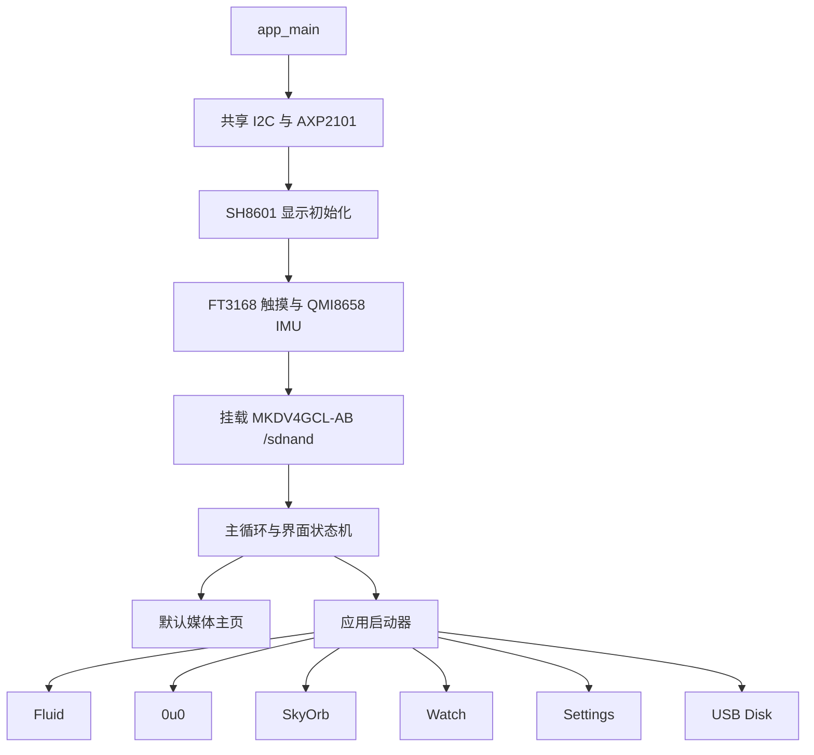

# PACON 固件设计文档

更新日期：2026-08-05  
适用工程：`D:\my_project\Pacon\my_Pacon`  
目标环境：ESP-IDF v5.4.3，ESP32-S3，默认下载/调试端口 COM11

## 1. 文档定位与事实优先级

本文描述 `my_Pacon` 当前正式固件的整体设计，供后续开发者和 Agent 快速接手。内容以当前源码为准，并把已经集成的功能、仅在测试工程验证的外设、尚待验证的修改分开记录。

发生冲突时，按以下顺序判断：

1. 当前源码、`sdkconfig`、原理图和目标板实测结果；
2. 本文档；
3. `USB_MSC_NOTES.md` 等专题文档；
4. `DEVELOPMENT_LOG.md` 和 `POWER_KEY_AND_PMIC_DIAGNOSIS.md` 中的历史记录。
5. `POWER_SAVING_PLAN.md` 中的 AMOLED 安全与 250 mAh 电池节能分阶段计划。

历史日志保留了排障过程，其中部分阶段性结论已被后续实测推翻，不能脱离日期直接作为当前设计依据。

## 2. 产品目标

PACON 是一块圆形电子吧唧。默认界面用于显示静态图片或短动画；从顶部下拉进入应用列表。当前主要功能包括：

- 本地图片/动画电子吧唧；
- 倾斜和触摸交互的流体效果；
- 仿 OuO 风格的互动表情；
- SkyOrb 飞机雷达；
- 原创金色机械模拟表盘；
- Wi-Fi 与 SkyOrb 参数设置；
- 通过 BLE HID Consumer Control 遥控手机相机；
- 将板载 SD NAND 临时切换为 USB U 盘。

现阶段目标是先保持硬件稳定、显示正确和交互流畅，再逐步扩展新应用。正式固件应继续支持在 VS Code ESP-IDF 插件中直接编译、下载和监视串口。

## 3. 系统结构



目前大部分实现集中在 `main/fluid_pendant.c`。这种结构便于快速实验，但模块间耦合较高，是后续重构的重点。

## 4. 硬件映射

### 4.1 已由正式固件使用

| 模块 | 芯片/接口 | ESP32-S3 引脚或地址 | 说明 |
|---|---|---|---|
| 共享 I2C | I2C0 | SCL GPIO1，SDA GPIO2 | PMIC、触摸、IMU 共用；超时 50 ms |
| PMIC | AXP2101 | I2C `0x34` | 支持 ID `0x4A` 和当前板实测的 `0x47` |
| 触摸 | FT3168/FT5x06 兼容驱动 | I2C `0x38`，RST GPIO4 | 睡眠时仍用于唤醒屏幕 |
| IMU | QMI8658 | I2C `0x6A` | 流体、0u0 和 SkyOrb 方位交互 |
| 圆屏 | SH8601 QSPI | RST 5，POWER 6，CS 7，CLK 8，D3 9，D2 10，D1 11，D0 12 | 475×466，SPI2_HOST |
| 板载存储 | MKDV4GCL-AB SD NAND | D2 14，D3 15，CLK 16，CMD 17，D0 18，D1 21 | SDMMC 4-bit，挂载点 `/sdnand` |

共享 I2C 外设跟随显示与页面状态节能。Home 等不使用倾斜交互的亮屏页面把 QMI8658
设为 ±8g、3 Hz low-power；Fluid 以及启用倾斜反应的 0u0 页面恢复 ±8g、250 Hz；
AMOLED Sleeping 时先关闭加速度计，恢复后丢弃前三个样本。FT3168 只在 AXP2101、
QMI8658、PCF85063 和触摸自身的共享总线往返验证通过后启用 Monitor；Watch 的硬件
手势引擎必须先关闭。FT3168 进入 Monitor 的写 ACK 是状态边界，不能紧接着读回确认：
该模式下其他从设备使用共享总线后，触摸控制器可能暂不响应，直到有效触摸自动恢复
Active。首个恢复触摸只负责唤醒 AMOLED，释放后才允许执行控件动作。
专用 TinyUSB MSC 模式始终由 VBUS 供电，且触摸是唯一的屏幕唤醒与退出入口，
因此该模式在 AMOLED Sleeping 时保留 FT3168 Active 扫描，不进入 Monitor。

### 4.2 已在测试工程验证、尚未正式集成

| 模块 | 接口 | 当前验证结果 |
|---|---|---|
| RTC PCF85063 | I2C `0x51` | 通信和走时已验证；首次上电 `VL=1` 属于时间未初始化提示 |
| 数字麦克风 MSM261S4030H0R | SCK GPIO39，WS GPIO40，SD GPIO47 | I2S 左声道已获得随声音变化的有效数据 |
| 蜂鸣器/扬声器 | GPIO48 | 测试固件中已听到声音 |

这些外设不能仅因测试通过就视为正式应用可用；接入主程序时仍需处理初始化顺序、资源冲突、功耗和 UI。

## 5. 启动和供电顺序

`app_main()` 当前按以下顺序启动：

1. 初始化共享 I2C；
2. 探测并配置 AXP2101；
3. 等待电源轨稳定；
4. 初始化 SH8601 并打开屏幕电源门控；
5. 初始化粒子、触摸和 IMU；
6. 探测并挂载 SD NAND；
7. 扫描媒体文件、建立缓存并进入主循环。

屏幕电源在 PMIC 和 I2C 初始化阶段由 GPIO6 明确保持低电平，避免复位默认态或电源尚未稳定时 OLED 提前点亮。`init_lcd()` 打开电源门后等待 20 ms，面板初始化期间亮度保持 0，再等待 40 ms 才恢复用户亮度。正常默认亮度为 `0x80`，约 50%；20 秒无操作降到 `0x24`。自动关闭时间可通过 BLE 设置为 15/30/60/120/300 秒或永不关闭，默认 60 秒，存储在 `pacon_ui/sleep_s`。触摸控制器保持工作，第一次完整触摸只负责唤醒，不直接触发应用。

为降低 OLED 静态烧屏风险，默认媒体界面的状态栏和静态内容会按周期做轻微位置偏移。固定高亮、高亮度和长时间静止画面仍应避免；“永不关闭”仅适合短时展示或调试，固件仍保留 20 秒降亮，但 Watch、Settings、0u0 等页面没有整体像素位移，长时间停留仍存在差异老化风险。

当前屏幕风险审查结论：启动时序、默认亮度、空闲降亮、面板真正关闭、触摸唤醒后的强制重绘、主页静态像素位移均已落实；没有发现会在正常供电下直接损伤面板的软件操作。剩余风险主要是 OLED 累积老化而非瞬时损坏，包括用户选择永不关闭、长期显示高亮静态表盘/设置页、以及把亮度长期调到 100%。固件不能判断屏幕实际供电轨是否超规格，硬件电压异常仍必须用万用表在板验证。

## 6. 显示与渲染约束

- 面板逻辑分辨率为 475×466，画布使用 RGB565；
- 完整工作画布放在 PSRAM；内部 SRAM 中保留 64 行 DMA 条带；
- SH8601 传输前需要交换 RGB565 字节序；
- 实测窄 X 区域更新会产生地址回绕、残影或覆盖，因此脏矩形优化只裁剪 Y 范围，X 始终发送完整 475 像素行；
- 流体等高帧率界面优先保证传输正确和视觉流畅，不能再次引入窄 X 窗口优化；
- 主页媒体读取由后台任务执行，避免单次约 200 ms 的 NAND 读取阻塞触摸轮询。

屏幕出现从上到下刷新的观感时，优先检查媒体读取是否阻塞、DMA 条带是否串行等待，以及一次帧更新是否被拆成过多事务，而不是先改变 SH8601 的稳定全行传输规则。

## 7. 界面状态与导航

当前界面状态包括：

| 状态 | 用途 | 主要进入/退出方式 |
|---|---|---|
| `UI_SCREEN_HOME` | 默认图片/动图主页 | 左右滑动切换媒体；顶部下拉进入应用列表 |
| `UI_SCREEN_APPS` | 应用启动器 | 点击图标进入应用；上滑或点击底部返回区以反向动画返回主页 |
| `UI_SCREEN_FLUID` | 流体 | 触摸显示控制；15 秒无触摸隐藏返回和设置按钮 |
| `UI_SCREEN_FLUID_SETTINGS` | 流体模式设置 | 选择三种形态，进入调色盘 |
| `UI_SCREEN_COLOUR_PICKER` | 独立调色盘 | 触摸连续选色并立即应用 |
| `UI_SCREEN_OUO` | 互动表情 | 触摸、拖动和晃动改变表情 |
| `UI_SCREEN_OUO_MENU` | 表情/心情菜单 | 选择预设状态后返回表情页 |
| `UI_SCREEN_SKYORB` | 飞机雷达 | 使用保存的网络、位置与量程配置 |
| `UI_SCREEN_WATCH` | 机械模拟表盘 | 读取 PCF85063；表盘样式由 Android 设置明确选择，左上角隐藏热区返回 |
| `UI_SCREEN_SETTINGS` | 设备设置 | 管理板端设置；快速点击顶部 `SETTINGS` 标题三次进入隐藏诊断页 |
| `UI_SCREEN_MIC_TEST` | 隐藏麦克风诊断 | 显示实时波形、RMS/峰值/底噪/削波；可录制最长 10 秒的单声道 WAV 到 SD NAND |
| `UI_SCREEN_USB_DISK` | USB U 盘交接 | 安全弹出后返回会软重启 |

### 7.1 统一视觉规范

2026-08-05 起，系统层界面采用适合 475×466 圆形 AMOLED 的 watchOS 启发式视觉语言。这里模仿的是布局原则和交互层级，不复制 Apple 图标、商标或系统资源。

- 背景以纯黑 `#000000` 为主，利用 AMOLED 黑位并降低常亮像素面积；
- 应用启动器使用圆形图标和蜂窝式排布，不在图标下堆叠文字；
- 返回、设置等高频操作优先使用圆形图标按钮；必须使用文字的主要操作采用胶囊按钮；
- 设置项使用深灰分组卡片：基础表面 `#1C1C1E`，抬升表面 `#2C2C2E`；
- 系统强调色统一为蓝色 `#0A84FF`，成功为绿色 `#30D158`，警告为橙色 `#FF9F0A`，危险为红色 `#FF453A`；
- 主文字使用接近白色 `#F5F5F7`，次要信息使用灰色 `#8E8E93`；
- 可见控件和触摸热区至少按 44×44 像素设计；圆屏边缘按钮向内收，避免内容被面板裁切；
- 沉浸式应用保留自身视觉身份：媒体主页继续全屏显示内容，Fluid 保留动态流体，0u0 保留黑底白色表情，SkyOrb 保留雷达画面；只统一导航和设置控件；
- 文字只用于状态或无法用图形明确表达的动作，能够用通用图形表达时不显示按钮文字。

当前已按该规范调整应用启动器、Fluid 设置与调色盘、0u0 菜单、SkyOrb 顶部控件、设备设置、USB Disk 状态页和 Fluid 浮动控制。触摸命中区域保持与原交互一致，避免视觉重构改变操作手感。

## 8. 默认媒体主页

正常启动后扫描 `/sdnand/media`，最多加载 12 个媒体文件。左右滑动使用软件合成的横向过渡，不应表现为立即跳图。主页下拉进入应用启动器；启动器上滑或点击底部返回区时，应用卡片向上移出、主页媒体从底部进入。动画播放期间，触摸手势的优先级高于下一帧解码/读取，以避免需要连续滑动多次才响应。

媒体格式规则：

- 扩展名为 `.rgb565`，允许 FAT 生成的 8.3 文件名别名；
- 每帧固定 475×466、RGB565 小端，共 442700 字节；
- 文件只有一帧时作为静态图片；多帧时循环播放；
- 文件名包含 `Nfps` 时以 N 帧每秒播放，否则默认 8 fps；
- 没有媒体目录、目录为空或文件无效时，显示初音青绿色备用界面。

主页顶部仅保留紧凑电池图标，百分比显示在图标内部；充电状态使用颜色或符号表达。布局应避开圆屏顶部裁切区，尽量少用文字。

## 9. 应用设计

### 9.1 Fluid

Fluid 源自 Opal_Fluid 的思路，并针对 PACON 的直接 QSPI 渲染路径重写。当前使用 220 个粒子，接收 QMI8658 倾斜重力和触摸扰动。

提供三种形态：`SIMPLE`、`BLOCKS`、`MATRIX`。颜色通过独立调色盘连续选择。渲染使用全宽脏 Y 条带；粒子物理与显示刷新解耦，以触感和流畅度优先。

### 9.2 0u0

0u0 是参考 OuO 交互风格实现的自绘表情，不是原应用代码的移植。眼睛和嘴会响应触摸位置、揉脸/拖动动作、设备倾斜和达到阈值的摇晃；还包含眨眼、开心、挤压、生气、惊讶、困倦、难过和眩晕等状态。

后续调整应以本地参考视频逐帧比对，避免随意新增与原作风格不一致的瞳孔、轮廓或自动循环表情。静止且无触摸时不应无理由快速轮换表情。

### 9.3 SkyOrb

SkyOrb 参考 GulfCoastMaker/SkyOrb 与 ESP32-Plane-Radar 的功能思路，适配为单块圆形 SH8601 屏幕。当前雷达刷新周期 180 ms，网络数据定期抓取周期 180 s，最多显示 28 架飞机。

Wi-Fi 开关保存的是用户联网意图，不等同于射频必须持续运行。STA 使用
`WIFI_PS_MIN_MODEM` 保持连接期间的 DTIM Modem Power Save；SkyOrb 成功完成 HTTPS
刷新后等待 5 秒再停止 STA，离开雷达页也请求停止。缓存数据仍可显示；雷达页到达
下一次 180 秒刷新、重新进入雷达、进入 Wi-Fi 设置扫描或请求 SNTP 校时时，网络任务
按需启动 STA 并重新完成 WPA/DHCP。自动暂停不会把 Wi-Fi 开关写成关闭。
mbedTLS 状态和动态 TLS 缓冲放在 PSRAM。ESP32-S3 以 240 MHz 运行时使用软件 AES，
避免硬件 AES 为 PSRAM TLS 记录额外申请同尺寸内部 DMA 跳板；内部 DMA 内存优先保留给
已经过显示实测的两条 QSPI 流水线条带。

雷达半径挡位为 5/10/15/25/35/50 km；其中 50 km 明确表示从屏幕中心到最外圈的半径，而不是直径。实时飞机按实际公里数映射到雷达半径；没有联网时不生成演示飞机。超出当前半径的目标只在外圈显示标记。画面持续显示 `RADIUS n KM`，并在中圈标出对应距离，确保顺/逆时针滑动切换后即使目标很少也能看出比例变化。

配置保存在 NVS 命名空间 `skyorb`，包括最多 5 个已保存 Wi-Fi、当前选中网络、经纬度、自动定位标记和量程。旧版单网络 `ssid/password` 键会迁移为第一个 profile，同时仍镜像选中项以便回滚旧固件。未设置经纬度时，可在联网后尝试通过公网地址获得粗略位置；该结果只适合作为默认值，不替代用户设置。

### 9.4 Watch

表盘提供两套明显不同且完全隔离的资源化样式。每次合成都先清空完整画布，再仅调用所选样式的专用合成器，禁止跨样式或程序生成底图混画。`KKD1` 使用用户提供的 `com.KKD1(1).apk` 中分离式表盘资源：人物的两只手臂直接承担时针和分针，背景的罗马小时环、分钟环和最外层秒环按 APK 图层组合显示，不再叠加程序生成的齿轮、表圈或传统线形时针和分针。`KKD2` 使用 `com.KKD2.apk` 的金色机械底盘、人物、独立手臂和小表盘资源；为逐项匹配 APK 的 XML，完整人物图层只按整数小时 `HOUR_0_23 * 30` 旋转，不插值分钟，独立手臂按 `MINUTE * 6` 旋转。因此在 16:02 的参考姿态中，人物旋转 120°，独立手臂旋转 12°，接近竖直并略向右偏。KKD2 原始 APK 的底图自身包含金色齿轮与中央转盘。两套表盘均每秒刷新一次。样式只由 Android 设置命令切换并持久化，表盘普通触摸不会再改变样式。

秒环不直接使用最近一次 RTC 采样值，而由独立的显示秒状态驱动。正常任务延迟造成 RTC 前进多秒时，显示状态用连续逐格帧追赶；较大的人工校时才直接跳转。刷新周期以渲染开始时刻为基准，避免把多图层旋转渲染耗时重复叠加到一秒周期中。

PCF85063 (`0x51`) 是持久时间基准。固件读取 `0x04..0x0A`；自定义时间和手机蓝牙校时写回 RTC，Wi-Fi 校时通过 SNTP 获取网络时间后同样写回 RTC。没有执行任何校时动作时直接使用 RTC；若 RTC 的 VL 标志置位或日期无效，则明确显示 `RTC SET` 并只用开机时长作临时显示，不把该临时时间写回 RTC。校时来源、表盘样式和每日闹钟保存在 NVS `pacon_clock`。

闹钟由主循环每秒检查 RTC 时间。只要 RTC 仍处于目标 `HH:MM` 且当天尚未触发，即使任务没有恰好采到该分钟最初两秒也会启动；GPIO48 蜂鸣器随后以 2 kHz、50% 占空比间歇响铃，最长 20 秒，同一天不会重复触发。触摸表盘或 BLE `STOP ALARM` 可提前停止。BLE `TEST ALARM` 可绕过时间条件直接验证蜂鸣器输出，并会明确返回 PWM 初始化/更新错误。BLE 还可读取时钟状态、设置时间、启动 Wi-Fi 校时、设置/关闭闹钟和切换表盘样式。

### 9.5 Settings 与 Wi-Fi 管理

配置入口只保留 BLE 与板端 Wi-Fi 页面。正式固件不再创建 `PACON-Sky` SoftAP，也不再内置 HTTP 配置服务器；联网代码始终使用 STA 模式。板端 Wi-Fi 页只显示已保存的 profile：点击一项会将其设为当前网络并连接，长按 700 ms 后显示删除按钮。扫描结果只用于给已保存 profile 标记可见性、RSSI 和 BSSID，不会把陌生热点放入列表。

Android 客户端将“设备与显示”、“Wi-Fi 管理”、“雷达设置”和“时钟与闹钟”分成独立区块。Wi-Fi 页可新增/更新 profile、点击连接和长按删除；雷达页只管理半径、经纬度和 IP 自动定位，不再修改 Wi-Fi 凭据。时钟页可读取 RTC、自定义日期时间、用手机本地时间通过 BLE 校时、请求设备通过 Wi-Fi/SNTP 校时、设置/关闭每日闹钟及停止当前响铃。

### 9.6 BLE HID 手机拍照遥控

正式固件在现有 NimBLE host 中注册标准 HID-over-GATT 服务 `0x1812`，包含
Consumer Control 的 `Volume Increment` 输入报告。BLE 广播同时携带 PACON
自定义服务和 HID 服务，避免为 HID 启动第二套 host；现有命令/媒体通道保持
不变。`CAMERA SHUTTER` 通过一个短任务发送按下报告和 35 ms 后的释放报告，
`SET CAMERA REMOTE ON|OFF` 提供显式安全开关，默认启用。Settings 页的
`Camera shutter` 行只在当前 BLE 链路可用时显示 READY，点击后请求一次快门。
手机首次使用需在系统蓝牙设置中把 `PACON-BLE-TEST` 配对为输入设备，并在
相机应用中启用“音量键快门”（若该相机提供此选项）；仅通过自定义 GATT 工具
连接不能让工具自身成为系统 HID 主机。
Android 工具的 `拍照 / 音量键快门` 按钮通过 PACON 自定义服务发送
`CAMERA SHUTTER`；因此手机需同时保留系统 HID 连接和工具连接。固件允许两条
NimBLE 连接，并按连接跟踪 HID 通知订阅，避免工具连接覆盖系统相机连接。

### 9.6 USB Disk

Disk 功能把 U2 的块设备所有权从固件交给电脑：

1. 正常模式由固件挂载 `/sdnand`；
2. 进入 Disk 页面只显示状态和开关，保持 USB Serial/JTAG 与 `/sdnand` 挂载，不自动切换；
3. 用户明确打开页面内开关后，固件才卸载 FAT 并启动 TinyUSB MSC，此时串口因 USB 重新枚举而断开；
4. 电脑独占文件系统，固件不能同时读写；
5. 电脑安全弹出后，在页面内关闭开关；
6. 固件软重启，恢复 USB Serial/JTAG 并重新挂载 NAND。

Type-C 正反插不能作为“串口/U 盘模式”选择信号。两种模式使用同一条有效 USB 数据通道，只能由应用明确切换。详细规则见 `USB_MSC_NOTES.md`。

## 10. AXP2101、电池与充电

正式固件接受 AXP2101 ID `0x4A` 和 `0x47`。当前目标板通信问题最终与周边错误器件/焊接有关，修正后 `0x47` 可稳定读取，因此历史文档中“AXP2101 一定损坏或无法软件访问”的阶段性结论已经过时。

当前软件配置目标：

- 充电目标电压 4.2 V（AXP2101 `0x64[2:0] = 0x03`）；
- 预充电电流 25 mA；
- 恒流充电 50 mA；
- 终止电流 25 mA，并启用终止；
- 启用电池检测、充电器和电量计；
- 每 5 秒读取 VBUS、BAT、VSYS、电量、充电状态和 PMIC 温度。

任何提高充电电压或电流的修改都必须先确认电池规格、实际截止行为、板温和测量点。寄存器显示目标值不等于物理端口已经安全截止；涉及电池的改动必须用真实电压和串口状态共同验证。

## 11. 存储、内存与并发

- ESP32-S3 外部 PSRAM 保存完整画布和媒体缓存；
- 内部 DMA 能力内存保存 LCD 条带；
- SD NAND 正常模式只由 VFS/媒体读取任务拥有；MSC 模式只由 PC 拥有；
- 媒体缓存当前有 4 个槽位，读取请求由后台任务处理；
- 主循环负责 UI 状态、触摸、渲染、休眠和周期性 PMIC 日志；
- 网络和 USB 栈启动时会占用额外任务和内存，新增功能必须检查栈大小、PSRAM 分配失败和 UI 卡顿。
- Wi-Fi、BLE 与显示同时工作后，内部 RAM 容易碎片化；mbedTLS 的连接状态和动态 RX/TX 缓冲固定从 PSRAM 分配，避免 HTTPS 握手因内部 RAM 最大连续块不足而返回 `MBEDTLS_ERR_SSL_ALLOC_FAILED`。

## 12. 工程与构建

工程根目录为 `D:\my_project\Pacon\my_Pacon`。根 `CMakeLists.txt` 复用相邻 `D:\my_project\Pacon\Pacon\components` 中的 SH8601、LVGL 和 CMake utility 组件。构建产物、配置缓存和下载文件保留在工程目录的 `build` 中，便于 VS Code ESP-IDF 插件继续使用。

分区表：

| 分区 | 类型 | 大小 |
|---|---|---|
| `nvs` | data/nvs | `0x6000` |
| `app0` | factory app | 15000 KiB |

常用流程：选择 ESP-IDF v5.4.3 环境，目标设为 ESP32-S3，在工程根目录编译；进入下载模式后从 COM11 烧录。只修改文档时不需要重新编译或烧录。

## 13. 验证状态

| 项目 | 状态 | 备注 |
|---|---|---|
| SH8601 显示、亮度、息屏和触摸唤醒 | 已在板验证 | App 超时到达时降亮度，15 秒后 Sleep；全行传输规则必须保留 |
| 图片/动画读取与左右切换 | 已在板验证 | 动画手势和刷新仍可继续优化 |
| Fluid 三种模式和调色盘 | 已在板验证 | 流畅度优先 |
| 0u0 基本触摸和 IMU 表情 | 已在板验证 | 与原应用的细节仍有差距 |
| AXP2101 `0x47` 通信与状态读取 | 已在板验证 | 充电安全继续以物理测量为准 |
| USB MSC 媒体拷贝 | 已在板验证 | 严禁双重挂载 |
| BLE/板端 Wi-Fi profile 管理 | 已在板验证 | 最多保存 5 个网络，点击连接、长按删除 |
| 旧 SoftAP/HTTP 配置路径 | 已移除并烧录 | 正式固件只保留 STA；HTTP 客户端供雷达与 IP 定位使用 |
| SkyOrb HTTPS/TLS 内存策略 | 阶段 3 真机通过 | mbedTLS 使用 PSRAM、动态缓冲和软件 AES，避免与显示 DMA 条带争用内部内存；失败按阶段显示并每 15 秒重试 |
| FT3168/QMI8658 外设待机策略 | 阶段 4 功能真机通过 | Home/非倾斜页 3 Hz、Fluid/0u0 TILT 250 Hz、熄屏 paused；普通页面 FT3168 Monitor，VBUS 供电的专用 MSC 保持 Active；首次触摸、Watch 手势互锁和 USB OFF 闭环均通过，物理电流待测 |
| ESP32-S3 DFS 与频率锁 | 阶段 5 功能真机通过 | 空闲 80 MHz、上限 240 MHz；UI/QSPI、TLS、WPA/DHCP 按作用域持最大频率锁，Tickless Idle/Light Sleep 尚未启用，物理电流待测 |
| SkyOrb 航班数据源 | ADSB.lol 公共 API | `/v2/point/{lat}/{lon}/{radius}`，readsb 兼容 JSON；客户端发送 PACON 项目标识，数据许可为 ODbL 1.0 |
| SkyOrb 空数据状态 | 明确显示 | 请求成功但所选经纬度与量程内没有飞机时显示 `NO AIRCRAFT / IN SELECTED RANGE`；OLED 从保护性息屏唤醒时强制重绘当前界面 |
| 系统界面统一 watchOS 启发式视觉 | 已编译，待板上确认 | 检查圆屏边缘、图标可辨识度和触摸命中 |
| PCF85063 与 GPIO48 蜂鸣器 | 已合入正式固件，待本轮板上验证 | 支持 RTC、自定义/BLE/Wi-Fi 校时和每日闹钟 |
| 数字麦克风 | 已合入隐藏诊断页并完成编译、烧录和启动验证 | 16 kHz/16-bit 单声道，实时电平与波形；录音保存为 `/sdnand/MIC_TEST.WAV`，通过 USB Disk 导出后试听 |

## 14. 开发约束与后续重构

开发时应遵守以下不变量：

- 不把芯片封装焊盘号当作 ESP-IDF GPIO 编号；
- 不在同一时刻让 MSC 和固件 VFS 同时访问 NAND；
- 不恢复已证明会产生残影的窄 X 显示窗口；
- 不用一次 I2C 扫描成功代替连续寄存器读写验证；
- 不仅凭 AXP 寄存器配置判断真实充电电压；
- 不让耗时 NAND/网络操作长时间阻塞触摸和 UI；
- 新增静态 UI 时考虑 OLED 亮度、自动息屏和像素位移。

建议按下列边界逐步拆分 `fluid_pendant.c`，每次只做可验证的小步重构：

```text
main/
  bsp/        引脚、I2C、LCD、触摸、IMU、PMIC、RTC、音频
  display/    画布、DMA、SH8601 刷新和图元
  media/      NAND、缓存、媒体索引和 USB MSC
  ui/         状态机、手势、状态栏和应用启动器
  apps/
    fluid/
    ouo/
    skyorb/
    settings/
  network/    STA、配置 AP、HTTP 和定位
```

重构前后必须分别验证启动、主页、触摸、息屏、三种 Fluid 模式、0u0、SkyOrb、Disk 交接和串口日志，避免一次拆分掩盖硬件时序问题。

## 15. 相关资料

- `README.md`：工程的简短入口说明；
- `DEVELOPMENT_LOG.md`：按时间记录的开发和排障历史；
- `USB_MSC_NOTES.md`：U 盘模式及媒体格式；
- `POWER_KEY_AND_PMIC_DIAGNOSIS.md`：早期电源键与 PMIC 排查记录；
- `assets/media/README.md`：媒体资源制作说明；
- `main/fluid_pendant.c`：当前实现的最终事实来源。
# 2026-08-09 Settings and BLE delta

The formal application now has a fixed-header, vertically scrollable Settings screen. Bluetooth is exposed as a switch and uses the verified `PACON-BLE-TEST` NimBLE service. Display brightness is changed with a slider and persisted in NVS (`pacon_ui/brightness`). Wi-Fi/AP remains only as a transitional SkyOrb configuration path and is no longer started just by opening Settings. Remove that path after BLE `GET/SET` commands for Wi-Fi, display, SkyOrb, and media have been implemented and tested; see `SETTINGS_BLE_NOTES.md`.

## Launcher interaction and performance (2026-08-09)

The app launcher keeps one native RGB565 composition in PSRAM while it is visible.  Its upward return transition therefore reuses cached icon pixels and overlaps two full-width LCD DMA stripes instead of recomputing the complete icon scene for every animation step.  Any page transition invalidates this cache before another app page is entered.

Page-changing contacts are edge-triggered: after opening or dismissing the launcher, touch handling remains blocked until FT3168 reports zero contacts.  This avoids stale touch state after a long display flush and prevents a subsequent pull from being interpreted as a continuation of the preceding swipe.

The launcher also has a four-step downward entrance animation.  Upward and downward transitions share a scanline compositor backed by the PSRAM home/launcher caches, so the animation does not rebuild icon geometry for every pixel.

The launcher compositor must keep only one horizontal pixel loop per scanline.  A duplicated nested loop was removed after runtime testing because it amplified CPU work and could trigger the task watchdog during page transitions.

The vertical Settings page uses a full-canvas first frame, then clears/recomposes only the scrollable card viewport.  Its dirty rectangle is sent with the two LCD stripe buffers in flight so finger scrolling can overlap CPU composition and QSPI DMA.

Settings labels use direct glyph-bitmap composition with viewport clipping, and card icons use the same scroll offset as their text.  This avoids repeated per-pixel string searches and prevents fixed-position artifacts during scrolling.

OuO's settings/menu remains visually unobtrusive but uses a broad bottom-left long-press zone.  Minor finger drift is tolerated and the release path confirms the hold duration, making the hidden control dependable even when a display render delays one polling tick.

## BLE configuration protocol (2026-08-09)

The existing `PACON-BLE-TEST` service keeps `PING`/`PONG` for regression testing and now forwards line-oriented configuration commands to the application. Supported settings commands are `GET STATUS`, `GET SETTINGS`, compact `GET RADAR`, `GET HELP`, `SET BRIGHTNESS 0..100`, `SET SCREEN TIMEOUT 0|15|30|60|120|300`, `SET RANGE 0..5`, `SET LOCATION lat lon`, and `SET AUTO_LOCATION`. `GET STATUS` is a compact overall summary; `GET SETTINGS` is a separate brightness/screen-timeout response. `GET RADAR` returns location validity/source, latitude, longitude, range, asynchronous state, and a stable failure code. Every response that uses the single-notification command channel must fit `negotiated ATT MTU - 3`; the BLE layer rejects an oversized response with a compact error instead of attempting the notification. `ble_gatts_notify_custom()` owns its mbuf on both success and failure, so application code must never free that buffer after the call. The Android client polls the compact radar response while automatic public-IP location is running. The firmware tries two key-free providers in sequence; failure remains non-fatal and manual coordinates always override automatic results. Wi-Fi profiles use `GET WIFI LIST`, `GET WIFI <index>`, `SET WIFI ssid|password`, `SELECT WIFI <index>`, and `DELETE WIFI <index>`. `SET WIFI` upserts by SSID, accepts an empty password for an open network, selects the resulting profile, and stores at most five profiles. Brightness and screen timeout are persisted in `pacon_ui`; SkyOrb values use its existing NVS keys. Responses never expose Wi-Fi passwords. A separate media command state machine handles native RGB565 uploads.

The media extension uses `MEDIA_BEGIN`, a binary `MEDIA_DATA_UUID` windowed
channel, `MEDIA_END`, and `MEDIA_ABORT`.  Transfers are native `475x466`
RGB565 frames and use a short FAT-compatible staging file plus an atomic
rename.  The binary channel carries a four-byte little-endian offset followed
by raw RGB565LE bytes and emits one cumulative acknowledgement per eight
packets.  The original hexadecimal command path remains as a compatibility
fallback for older firmware.  The NAND
reader is paused during replacement; the main UI task rescans the carousel only
after the commit, so an animation cannot observe a partially written frame.
When the media directory was empty at boot, the cache/task runtime is initialized lazily on the
first committed upload, so the new asset becomes visible without a reboot.
The lazy-initialization build was flashed to COM11 and boot-checked on 2026-08-10;
NAND mount, PMIC telemetry, and the display task all started normally.

Media management commands (2026-08-11): the same BLE command characteristic
now accepts MEDIA_LIST, MEDIA_INFO <index>, and MEDIA_DELETE <name>. LIST/INFO
enumerate valid native RGB565 files on /sdnand/media without replacing the
active renderer snapshot; DELETE validates the filename, pauses the NAND
reader, removes the file, and schedules the existing main-task rescan.

## Wi-Fi profile switching and Sky Radar navigation (2026-08-15)

Wi-Fi selection is serialized by the network task rather than executed from a
UI or BLE callback. Every profile change follows `disconnect -> scan ->
connect`; reconnect callbacks are suppressed during the hand-off. This keeps
the saved-profile UI and BLE protocol behavior identical and prevents an
established old AP from consuming the first connection attempt.

Sky Radar owns the complete round display surface. Navigation chrome is not
drawn: the upper-left corner is a documented invisible return target. Range is
treated as a rotary gesture around the display center, with screen-clockwise
motion selecting the next range and counter-clockwise motion selecting the
previous range. Small angular motion is ignored.

Aircraft are rendered only while the Wi-Fi station is connected. An offline
radar still animates its sweep and presents the selected scale, but never
shows synthetic or stale targets. Network-state and range strings are centered
from measured font advances, so status changes do not shift the visual center.
The launcher represents 0u0 with the defining geometry of the official OuO
Android icon: a black field, two white circular eyes placed on a diagonal, and
a white crescent mouth. A thin dark-grey rim separates it from the launcher
background. This changes only launcher artwork and not the interactive
expression engine.

The Android BLE client treats connection state as explicit UI state. Connection
controls are mutually enabled, and service readiness—not merely a physical BLE
link—marks the device usable. The content lives in an adjusting ScrollView so
credential inputs remain visible when the software keyboard opens.

The diagnostic output is a retained, independently scrollable pane rather than
an anonymous nested view. Each new line scrolls that pane to the latest entry,
while manual dragging temporarily keeps the outer page from intercepting the
gesture. The activity applies the current top and bottom system-bar insets to
its root padding (including the pre-Android-30 fallback), so the first controls
and final log lines remain outside the status and navigation bars on enforced
edge-to-edge Android releases.

Before opening a GATT connection, the Android client stops its low-latency BLE
scan. Interactive commands (including `PING`) and the automatic media-catalog
refresh use the same single-thread executor, so Android never starts two
acknowledged characteristic writes concurrently. The automatic refresh waits
1.2 seconds after the response CCCD is enabled; this preserves the reconnect
catalog behavior without racing the first user command.

The client explicitly requests BLE 1M PHY on Android 8 and newer. A subsequent
A/B trace proved that forcing 1M alone did not stop the five-second supervision
timeout: an idle connection and `PING` remained stable, while the oversized
`GET SETTINGS` notification path failed. The 1M preference is retained as the
conservative RF choice, but notification size and mbuf ownership—not PHY 2M—
were the protocol defect. Media throughput remains controlled by the existing
MTU/window protocol.

## KKD1 watch-face composition

KKD1 follows the original Watch Face Format XML rather than treating the
character artwork as a conventional set of rotating hands. The character and
her two arms are static. Three concentric APK image layers rotate underneath
them: the minute dial by `minute * 6 degrees`, the second dial by
`second * 6 degrees`, and the Roman-hour dial by `90 - hour * 30 degrees`.
This makes the upward arm read the minute scale and the rightward arm read the
hour scale. The fixed layer order is minute, second, hour, mechanism,
complication bezel, complication text, then character.

As a semantic reference frame, at `00:02` the static rightward arm must meet
Roman `XII`, while the static upward arm must meet minute tick `2`. A board
photo showing this arrangement confirms the layer transforms; it does not
indicate KKD1/KKD2 overlap. If the real local time is not `00:02`, diagnose the
RTC/time-sync path instead of changing the dial angles.

The ornate complication bezel is the APK `wfs_6` resource scaled into its XML
box `(106,121)-(216,231)`. Its dynamic time/date text is centred on the XML
slot at x=161. Do not replace it with a procedural panel or move it to the
left; that makes the centre look like another watch face has been overlaid.
`tools/compare_kkd1_rotation.py` recovers the expected dial angles directly
from the APK preview, while `tests/check_kkd1_complication_layout.ps1` locks
the bezel geometry and embedding contract.

KKD style selection is verified rather than optimistic. `SET WATCH STYLE`
persists the requested index, invalidates the watch cadence, and the next UI
render clears the full panel to black before drawing only the selected
compositor. `GET CLOCK` exposes both `style` and `style_name`; the Android
client reads this back after every change and shows the confirmed device style.
The black transition is deliberately owned by the UI task, not the BLE
callback, so display DMA remains single-owner.
