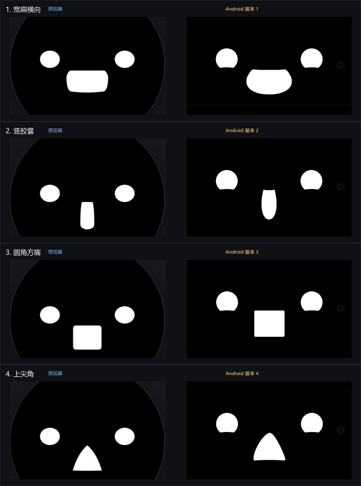

# 拉嘴实验对比

左列是预览器固定方向实验，右列是本轮提供的 Android app 基准截图。

## 观察

- 四个固定参考形现在使用独立轮廓：横向宽扁填充、纵向窄胶囊、圆角方嘴和上尖角，不再把横向研究按钮误画成极限侧拉 `3` 嘴。
- 四个嘴形的宽高比、嘴/眼垂直间距和参考帧压扁眼睛由截图回归脚本校验；普通情绪嘴仍使用原来的锚点。
- 这张图验证的是代表形状；预览器真实拖动现在也复用连续向量轮廓，但仍需要在真机上按连续轨迹复核触摸采样和像素观感。
